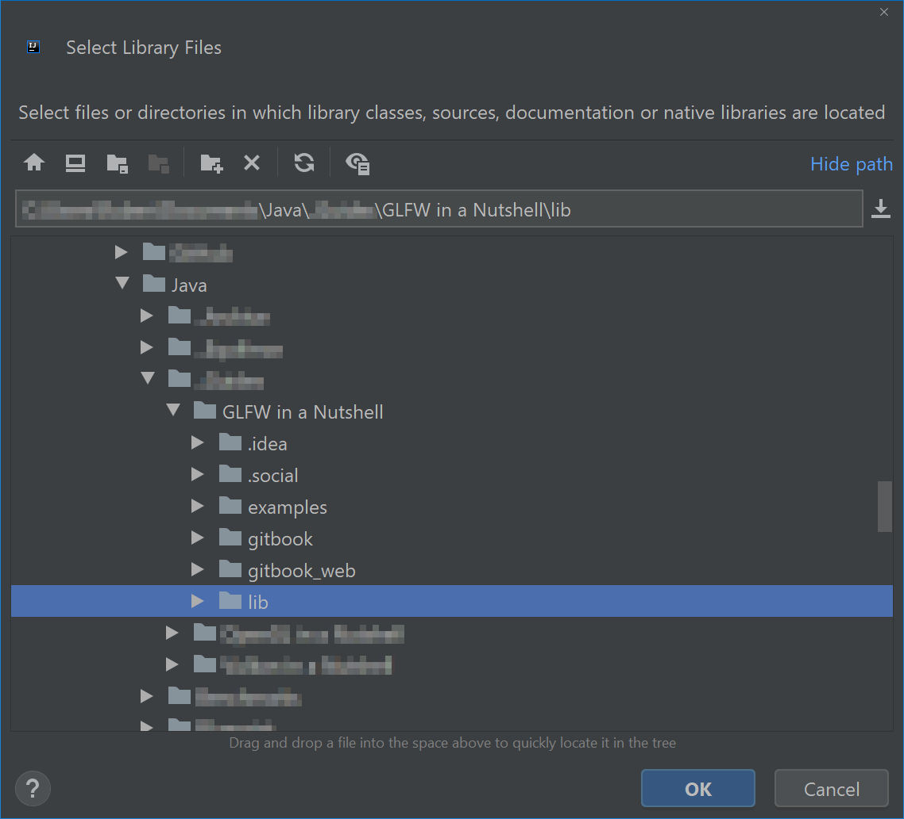

# \[Ignore\] Syntax Test

Before tab



Text in first tab

> Funny



Text in second tab

> Not so funny



After tab

Before hint


Within info hint



Within warning hint



Within warning hint



Wihtin success hint


After hint

Before image

After image

Before inline image

Some text about this  button

After inline image

